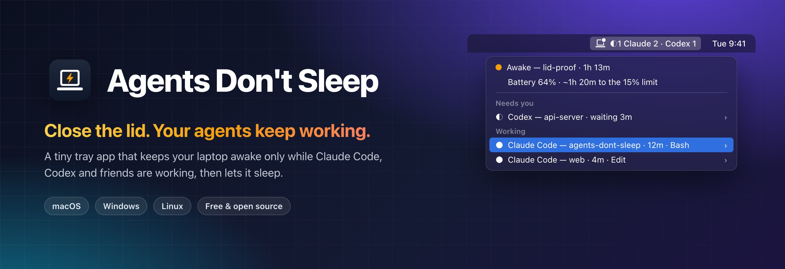
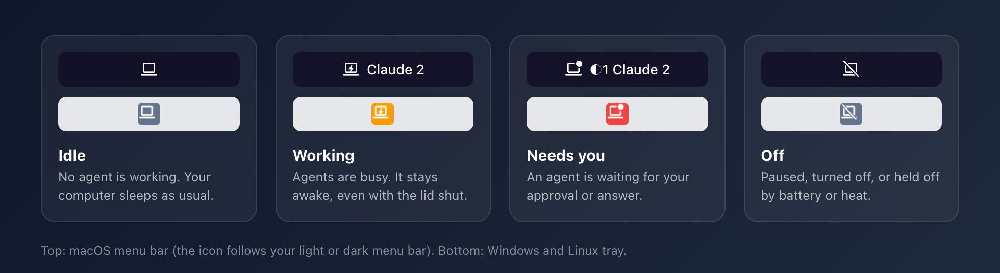
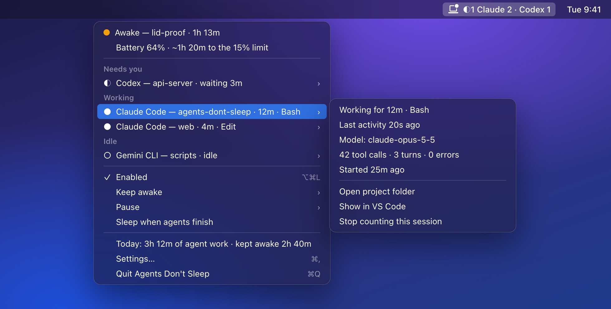
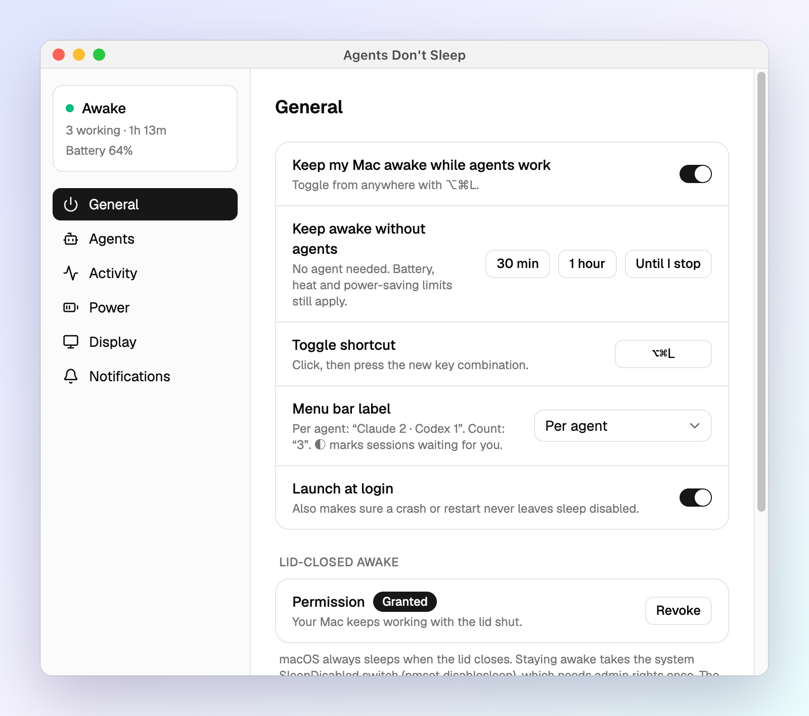
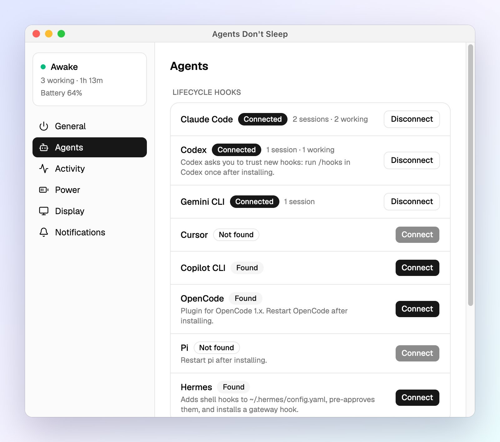
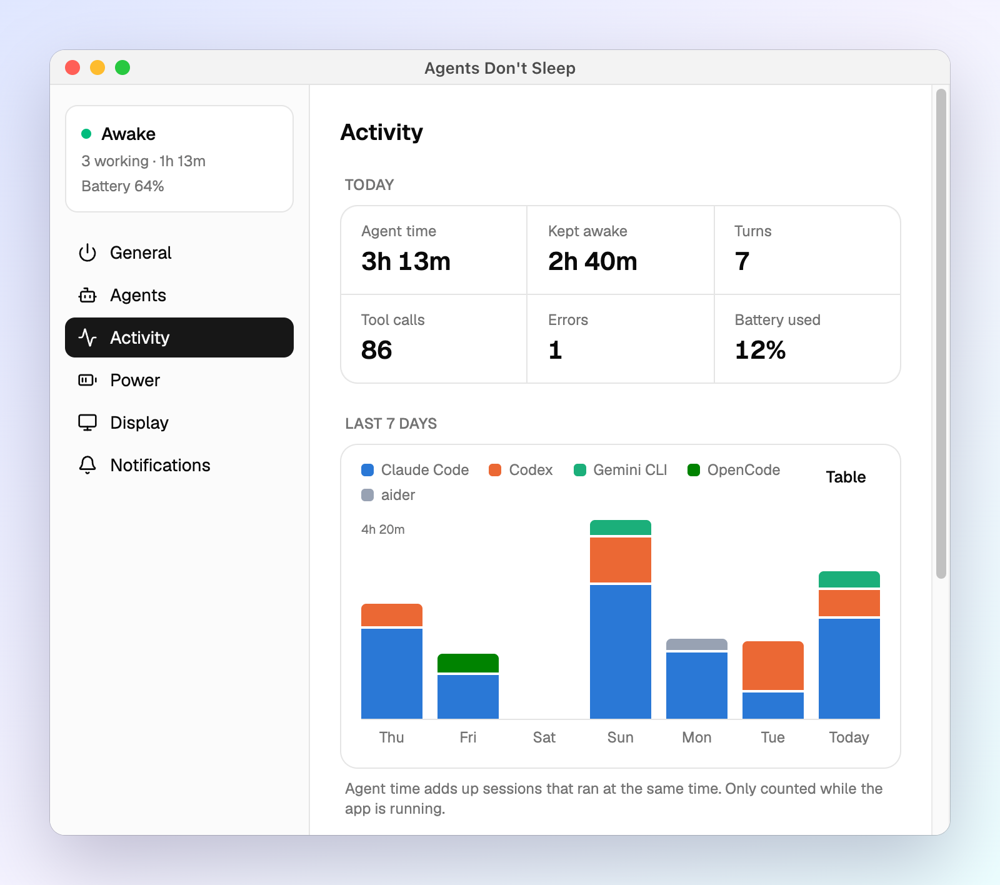
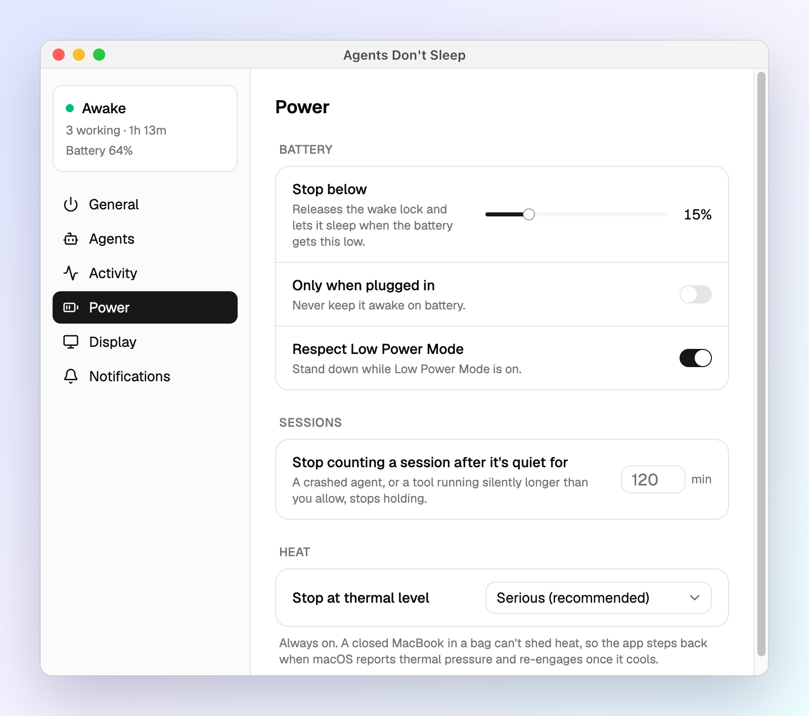
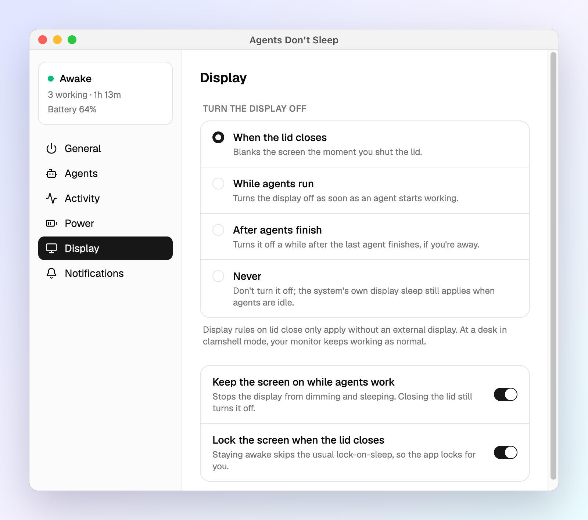
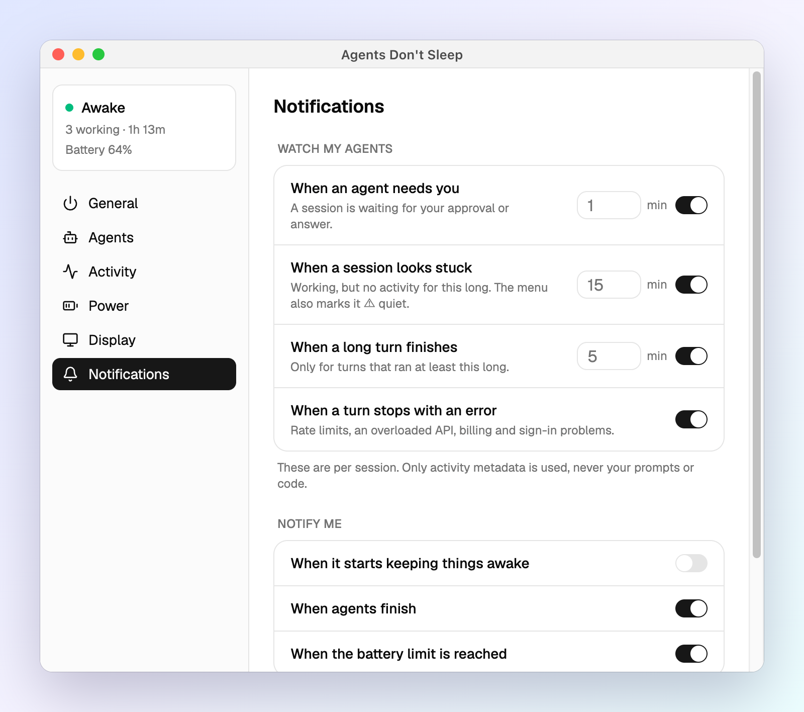

  

  
  
  
  

Your agent is twenty minutes into a refactor. You close the lid to catch a train. The laptop falls asleep, and the agent stops mid-sentence.

**Agents Don't Sleep** fixes that. It keeps your laptop awake **only while your agents are working**, even with the lid shut and the laptop in your bag. When they finish, it lets the laptop sleep.

It works with Claude Code, Codex, Gemini CLI, Cursor, Copilot CLI, OpenCode, Pi and Hermes, on macOS, Windows and Linux.

<a href="https://github.com/itsmbaqer/agents-dont-sleep/releases/latest"><b>Download the latest release →</b></a>

## The idea

**Awake only while it matters.** It isn't "always on", and it isn't a timer you forget to cancel. While an agent works, your laptop stays up. When the agent is idle, the laptop sleeps.

**The agent tells us.** No guessing from CPU use. Each agent reports *working*, *waiting for you* or *done* through its own lifecycle hooks.

**Zero babysitting.** Connect an agent once, with one click. After that, you don't think about it again.

**Safe by default.**
- Battery cut-off, heat limit, and screen lock when you close the lid.
- Every setting it changes goes back when agents finish, when you quit, and even after a crash.

**Private by design.** It keeps names and timings, never your prompts, code or output. Nothing leaves your computer.

### Goals

1. Never lose agent work to sleep.
2. Never waste battery on a computer with nothing to do.
3. See what every agent is doing at a glance.
4. Stay out of your way.

## Why it makes your day better

| Without it | With Agents Don't Sleep |
|---|---|
| You babysit an open laptop until the agent finishes. | Close the lid and go. |
| You tab through terminals to see who's done. | One look at the menu bar. |
| An agent waits 40 minutes for a permission you never saw. | A notification after 1 minute. |
| A rate limit quietly ends a long run. | "Claude Code stopped: rate limited". |
| `caffeinate` keeps the laptop up all night for nothing. | It sleeps the moment the work is done. |

## A quick tour

### The menu bar icon

The icon tells you the state without opening anything.
- **Next to the icon:** a working-session count per agent, like `Claude 2 · Codex 1`.
- **`◐` in front:** an agent is waiting for you.
- **On Windows:** the tray can't show text, so the same line appears in the tooltip.

### The menu

| Part | What it tells you |
|---|---|
| **Status** | Awake or idle, for how long, and whether the lid is covered ("lid-proof"). |
| **Battery** | The current level, and how long until the cut-off at the current drain. |
| **Sessions** | Grouped by what needs you: *needs you*, *stopped with an error*, *working*, *idle*. Each row shows the agent, project, turn time and current tool. |
| **Session details** | Hover a row for last activity, model and counts. From there: **open the project folder**, **jump to its terminal** (VS Code, Cursor, iTerm, … on macOS), or **stop counting it**. |
| **Keep awake** | 30 min, 1 h, 2 h, or until you stop it. No agent needed. |
| **Pause** | Take a break without changing any settings. |
| **Sleep when agents finish** | A one-time "put it to sleep when the work is done". It only sleeps if you're away from the keyboard. On Windows, normal idle sleep takes over instead. |
| **Today** | Agent time and time kept awake so far. Click it for the Activity tab. |

The menu updates live while it's open, so you can watch a turn tick along.

## Settings, and why each one exists

<b>General</b>: the basics

 

| Setting | Why |
|---|---|
| **Keep awake while agents work** | The main switch. Flip it anywhere with <kbd>⌥⌘L</kbd> (<kbd>Ctrl+Alt+Shift+L</kbd> on Windows and Linux). |
| **Keep awake without agents** | For the times you need it: a long download, a demo, a build you started by hand. |
| **Menu bar label** | Per agent, a single count, or icon only, for a quiet menu bar. |
| **Launch at login** | So it's there when you need it. It also restores anything a crash or reboot left behind. |
| **Lid-closed permission** (macOS) | macOS always sleeps when you close the lid. This one-time admin grant allows exactly one command, the switch that stops that, and only while agents work. |
| **Remove all integrations** | The step before you uninstall. It leaves every agent's config exactly as it was. |

<b>Agents</b>: connect once, forget about it

 

- **Connect** adds a small hook to that agent's own config.
- From then on, the agent reports when a turn starts, when it needs your approval, and when it's done. That's how the app knows *real* work from an open terminal.
- **No hooks?** Tools like aider or goose count as working while their process runs. Edit that list at the bottom.

<b>Activity</b>: how your day went

 

**Why it's here:** you see where agent time goes, and what keeping the laptop awake cost you in battery.
- **Today:** agent time, time kept awake, turns, tool calls, errors and battery used.
- **Last 7 days:** a chart per agent. Hover a day for details, or switch to the table view.
- **Today's sessions:** each one with its project, working time and counts.

<b>Power</b>: protect the battery

 

| Setting | Why |
|---|---|
| **Stop below N% battery** | An agent run should never leave you with a dead laptop. |
| **Only when plugged in** | For people who never want the battery drained. |
| **Respect Low Power Mode** (Battery saver, Power saver) | When you ask the OS to save power, the app backs off. |
| **Stop counting a quiet session after** | A crashed agent, or a tool that runs silently too long, stops holding the laptop awake. |
| **Heat limit** (macOS, Linux) | A closed laptop in a bag can't cool down. The app steps back when the system reports heat, and comes back once it cools. |

<b>Display</b>: screen on, or off

 

| Setting | Why |
|---|---|
| **Keep the screen on while agents work** | So you can watch the run without the screen dimming. |
| **Turn the display off** (on lid close, while agents run, or after they finish) | Save power when nobody is watching. |
| **Lock the screen when the lid closes** | Staying awake skips the usual lock-on-sleep, so the app locks for you. Nobody opens your bag to an unlocked laptop. |

<b>Notifications</b>: only when it matters

 

| Alert | Why |
|---|---|
| **An agent needs you** (after 1 min) | Agents stall on approvals. You hear about it right away, not an hour later. |
| **A session looks stuck** (15 min) | No activity for a long time usually means something hung. The alert names the tool it's stuck in. |
| **A long turn finished** (5 min) | Go do something else, and come back when it's done. |
| **A turn stopped with an error** | Rate limits and API outages end runs silently. Now they don't. |

Each alert fires once per episode, not on repeat. You can also get a notification when it starts keeping the laptop awake, when agents finish, and at the battery limit, with a sound of your choice.

## Install

Download from **[Releases](https://github.com/itsmbaqer/agents-dont-sleep/releases/latest)**. The builds aren't code-signed yet, so your OS asks you to confirm once.

**macOS 14 or later**
1. Open the `.dmg` for your Mac (`aarch64` for Apple silicon, `x64` for Intel) and drag the app to Applications.
2. Open the app. When macOS says it can't verify the developer, go to **System Settings → Privacy & Security → Open Anyway**. Or run `xattr -dr com.apple.quarantine "/Applications/Agents Don't Sleep.app"`.
3. In the window that opens, click **Grant…** under *Lid-closed awake* and enter your password once.

**Windows 10 or 11**
1. Run the `_x64-setup.exe`. It installs for your user, with no admin needed.
2. When SmartScreen says *Windows protected your PC*, click **More info → Run anyway**.

PCs with Smart App Control turned on block unsigned apps entirely.

**Linux (systemd)**
- `sudo apt install ./Agents*_amd64.deb` (Debian, Ubuntu)
- `sudo dnf install ./Agents*.x86_64.rpm` (Fedora, openSUSE)
- or run the `.AppImage`

On Fedora GNOME, enable the *AppIndicator and KStatusNotifierItem Support* extension to see the tray icon.

Then open **Settings → Agents** and click **Connect** for the agents you use.

## Supported agents

| Agent | Connects through | Good to know |
|---|---|---|
| Claude Code | hooks in `~/.claude/settings.json` | Tested end to end |
| Codex | `~/.codex/hooks.json` | Run `/hooks` in Codex once to trust them |
| Gemini CLI | hooks in `~/.gemini/settings.json` | |
| Cursor | `~/.cursor/hooks.json` | Only listens; never answers permission prompts |
| Copilot CLI | `~/.copilot/hooks/` | Needs PowerShell 7 on Windows |
| OpenCode 1.x | a plugin | Restart OpenCode after connecting |
| Pi | an extension | Restart pi after connecting |
| Hermes | `~/.hermes/config.yaml` plus a gateway hook | |
| aider, goose, cline, conductor, … | process detection | Counted as working while running. The list is editable. |

Only Claude Code has been tested end to end so far. The others follow each agent's current hook docs, and bug reports are welcome.

## How it works

| | macOS | Windows | Linux |
|---|---|---|---|
| **Lid closed** | Kernel `SleepDisabled` (`pmset disablesleep`), through a one-time sudoers rule that allows only that command | The power plan's lid action is set to "Do nothing" and battery idle sleep is turned off, then restored | A logind inhibitor on `sleep:idle:handle-lid-switch`; on KDE, PowerDevil's lid action too |
| **Idle sleep** | `caffeinate -i` | A power request (`PowerSetRequest`) | The same inhibitor |
| **Lid-close lock** | `SACLockScreenImmediate` | `LockWorkStation` | `loginctl lock-session` |
| **Heat limit** | `NSProcessInfo.thermalState` | Not available | Thermal-zone trip points |
| **Admin needed** | Once | No | No |

If the app crashes, a small watchdog process puts every setting back. [SECURITY.md](SECURITY.md) lists every change the app makes, and how to undo each one by hand. On Wayland, the global shortcut and turning the display off are best effort.

## Privacy

- **What's kept:** tool **names** (`Bash`, `Edit`), the model name, the project folder, the terminal app, timings and counts.
- **What isn't:** prompts, commands, file contents and tool output.
- **Where:** everything stays in `~/.agents-dont-sleep/`. Daily stats are kept for 30 days.
- **Network:** the app makes no network requests and has no telemetry.

## FAQ

**Does it really work with the lid closed and no external monitor?**
Yes. That's the whole point. Try it: start a long task, close the lid, and open it later. The work will be done.

**Will it drain my battery?**
Only while agents work, and it stops at your battery limit (15% by default). The menu shows how long the battery will last at the current drain.

**How is this different from `caffeinate` or Amphetamine?**
Those keep your laptop awake until you turn them off. This one follows your agents: it's awake while they work, and asleep when they're done.

**Why does macOS ask for my password once?**
macOS always sleeps when you close the lid. Stopping that takes one system switch that needs admin rights. The rule the app installs allows exactly that command and nothing else.

**Why is the app unsigned?**
Code signing costs money and needs an Apple and Microsoft identity check. Until then, your OS asks you to confirm once. The source is all here, and every build comes from CI.

## Uninstall

1. **Settings → General → Remove all.** On macOS, also click **Revoke**.
2. Quit from the tray and delete the app.
3. Optional: delete `~/.agents-dont-sleep/`.

Skipped step 1? The hooks keep working harmlessly. They write small files that nothing reads.

## Contributing

Bug reports and PRs are welcome. [CONTRIBUTING.md](CONTRIBUTING.md) covers building from source, the code layout, and how releases work (they're automated with Changesets).

## License

MIT. Inspired by [Hold My Lid](https://holdmylid.app), and not affiliated with it.
