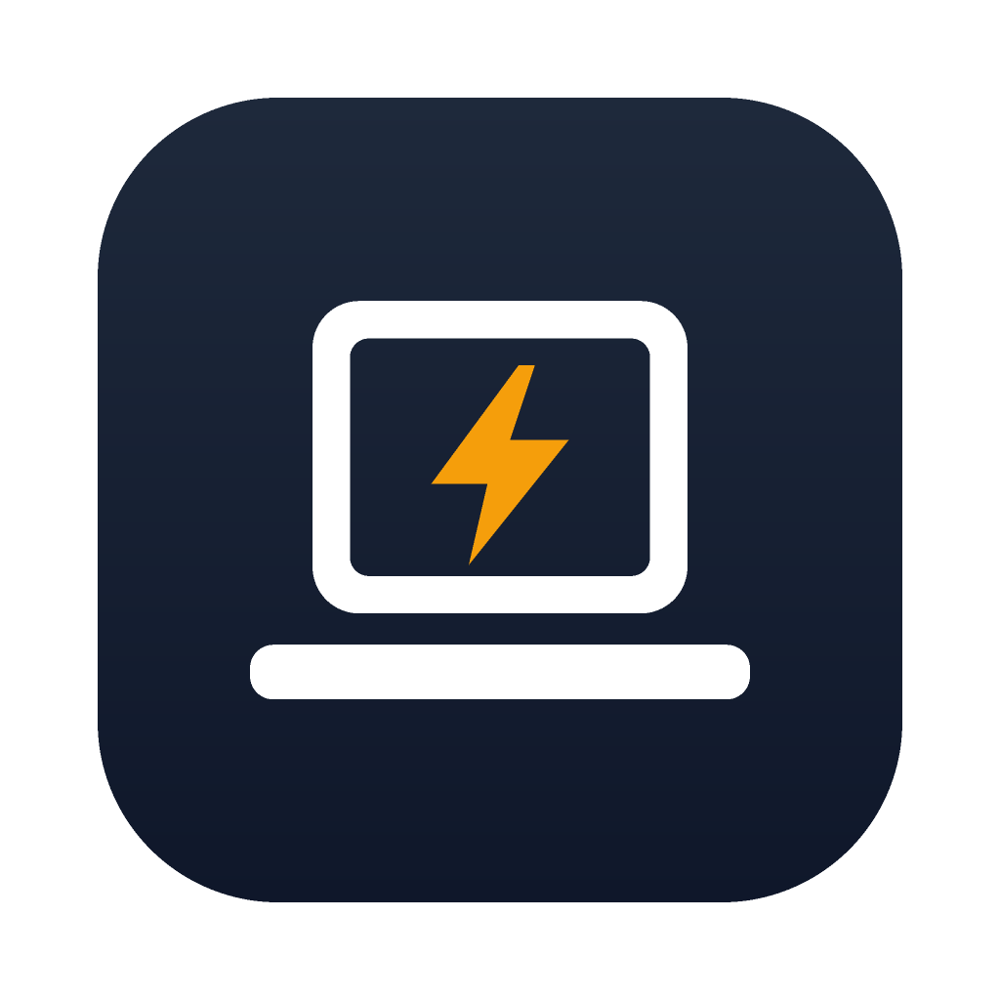

<p align="center"></p>

# Agents Don't Sleep

A small tray app that keeps your laptop awake, even with the lid closed and in your bag, while Claude Code, Codex and other coding agents are working. When they finish, it lets the laptop sleep again. It runs on macOS, Windows and Linux.

- **Knows when agents are actually working.** It uses each agent's lifecycle hooks, not a timer. An idle agent doesn't keep your machine awake.
- **Lid-proof.** It keeps running with the lid shut, with no external display needed.
- **Safe.**
  - A battery cut-off, plus "only when plugged in".
  - It respects Low Power Mode / Battery saver, and has a heat limit on macOS and Linux.
  - It locks the screen on lid close.
  - Every setting it touches is restored when agents finish, when you quit, or after a crash.
- **Tray at a glance.**
  - Sessions are sorted by what needs attention: needs you, stopped with an error, working, idle.
  - Each session shows its turn timer and current tool, and has a submenu with details: open the project folder, jump to its terminal, or stop counting it.
  - The icon changes when an agent needs you. On macOS and Linux the label shows counts like `Claude 2 · Codex 1`.
- **Watches your agents.** It notifies you when a session is waiting for you, looks stuck, finishes a long turn, or stops with an error (rate limit, overloaded, …).
- **Activity.** Today's agent time, time kept awake, turns, tool calls and battery used, with a 7-day chart and a list of today's sessions.
- **Manual controls.** Keep awake for 30 min, 1 h or until you stop it (no agent needed), pause, "Sleep when agents finish", and a global shortcut.

## Install

Download the latest build from **[Releases](https://github.com/itsmbaqer/agents-dont-sleep/releases/latest)**.

The builds aren't code-signed yet, so each OS asks you to confirm once.

### macOS 14 or later
1. Download the `.dmg` for your Mac: `aarch64` for Apple silicon, `x64` for Intel. Drag the app to Applications.
2. Open it. macOS says it can't verify the developer.
3. Go to **System Settings → Privacy & Security**, scroll down, click **Open Anyway**, and confirm. (Or run `xattr -dr com.apple.quarantine "/Applications/Agents Don't Sleep.app"` in Terminal.)
4. In the window that opens, click **Grant…** under *Lid-closed awake* and enter your password once.

### Windows 10/11
1. Download and run the `_x64-setup.exe` installer. It installs for your user, with no admin needed.
2. SmartScreen shows *Windows protected your PC*. Click **More info → Run anyway**.
   - PCs with *Smart App Control* turned on block unsigned apps entirely.

### Linux (systemd)
- **Debian/Ubuntu:** `sudo apt install ./Agents*_amd64.deb`
- **Fedora/openSUSE:** `sudo dnf install ./Agents*.x86_64.rpm`
- **Anything else:** `chmod +x Agents*.AppImage && ./Agents*.AppImage`
- **Fedora GNOME tray:** install and enable the *AppIndicator and KStatusNotifierItem Support* extension.

## Connect your agents

Open **Settings → Agents** and click **Connect** for each agent you use.

| Agent | How | Notes |
|---|---|---|
| Claude Code | hooks in `~/.claude/settings.json` | Tested end to end on macOS |
| Codex | `~/.codex/hooks.json` | Run `/hooks` in Codex once to trust them |
| Gemini CLI | hooks in `~/.gemini/settings.json` | |
| Cursor | `~/.cursor/hooks.json` | Observe-only: it never answers permission prompts |
| Copilot CLI | `~/.copilot/hooks/agents-dont-sleep.json` | On Windows it needs PowerShell 7 (`pwsh`) |
| OpenCode 1.x | plugin in `~/.config/opencode/plugins/` | Restart OpenCode after connecting |
| Pi | extension in `~/.pi/agent/extensions/` | Restart pi after connecting |
| Hermes | `~/.hermes/config.yaml`, plus a gateway hook | |
| aider, goose, cline, conductor, … | process detection | Counted as working while the process runs. The list is editable. |

The hooks record activity metadata only: state, tool names, model, timings and counts. Prompts, commands, file contents and tool output are never kept (details in [SECURITY.md](SECURITY.md#privacy)).

Only Claude Code has been tested end to end so far. The other integrations follow each agent's current hook docs. Bug reports are welcome.

## How it works

| | macOS | Windows | Linux |
|---|---|---|---|
| Lid closed | Kernel `SleepDisabled` (`pmset disablesleep`), via a one-time sudoers rule | Power plan lid action set to "Do nothing" and battery idle sleep off, restored afterwards | logind inhibitor on `sleep:idle:handle-lid-switch`; on KDE, PowerDevil's lid action too |
| Idle sleep | `caffeinate -i` | Power request (`PowerSetRequest`) | Same inhibitor |
| Lid-close lock | Private `SACLockScreenImmediate` | `LockWorkStation` | `loginctl lock-session` |
| Heat limit | `NSProcessInfo.thermalState` | Not available | Thermal-zone trip points |
| Admin needed | Once | No | No |

Every change is listed in [SECURITY.md](SECURITY.md), along with how to undo it by hand. The Wayland caveat: global shortcuts and turning the display off are best effort.

## Uninstall

1. Go to **Settings → General → Remove all** under *Uninstall*. This disconnects every agent. On macOS, also click **Revoke**.
2. Quit the app from the tray, then delete it (drag it to the Trash, use *Apps & features*, or remove the package with your package manager).
3. Optionally delete `~/.agents-dont-sleep/`.

If you delete the app without step 1, the hooks keep working harmlessly. The helper in `~/.agents-dont-sleep/bin/` stays behind and writes files that nothing reads.

## Build from source

You need Node 20+, pnpm, and stable Rust. On Linux you also need `libwebkit2gtk-4.1-dev libayatana-appindicator3-dev librsvg2-dev`.

```sh
pnpm install
pnpm tauri dev              # also builds the adshook sidecar
cd src-tauri && cargo test --workspace
pnpm tauri build            # installers in src-tauri/target/release/bundle/
```

- **Code layout:**
  - `src-tauri/src/lib.rs`: loop, tray and commands
  - `decide.rs`: the hold/release rules
  - `power/{macos,windows,linux}.rs`: one API per OS
  - `agents.rs`: integrations and session scanning
  - `src-tauri/hook/`: the `adshook` helper
  - `src/`: the React settings window
- **Icons:** `python3 scripts/make-icons.py && pnpm tauri icon app-icon.png`

## Releasing

1. Bump `version` in `package.json`. Tauri reads it from there.
2. Run `git tag vX.Y.Z && git push origin vX.Y.Z`.
3. The *release* workflow builds every platform into a **draft** GitHub release. Test the installers, then publish it.

Signing can be added later with no code changes. Add the `APPLE_*` secrets listed in `.github/workflows/release.yml`.

## License

MIT. Inspired by [Hold My Lid](https://holdmylid.app); not affiliated with it.
